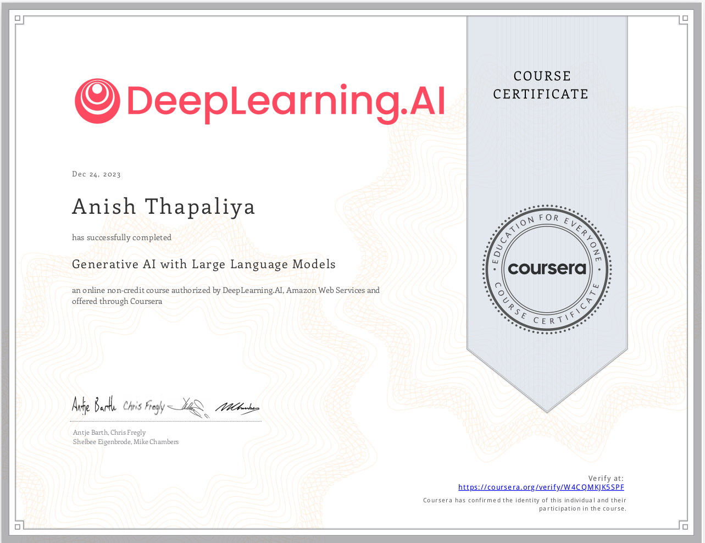

# Generative AI with Large Language Models
>>  This repository contains my personal notes and summaries on [Generative AI with LLMs by Deep Learning.ai](https://www.coursera.org/learn/generative-ai-with-llms)

>> If you're interested in advancing your knowledge and skills in Natural Language Processing (NLP) and working with cutting-edge Large Language Models (LLMs), this course is perfect for you! Throughout this comprehensive journey, you'll explore the transformative power of language models and learn how to harness their potential for real-world applications. 

# Course Certificate
I've successfully completed the course and earned my [certificate](https://coursera.org/share/53871f257db305ee64a7e3bbdade5577)!

-

# Course Overview

[DeepLearning.ai --> Generative AI with Large Language Models](https://www.coursera.org/learn/generative-ai-with-llms) course is designed to equip you with the essential concepts and practical techniques needed to work effectively with large language models. You'll start with a solid introduction to transformers, the architecture behind these powerful models. As you progress, you'll dive into the training process and gain insights into the extensive compute resources required to develop LLMs.
 
 ### Prerequisites

Before enrolling in this course, make sure you have a solid foundation in Python programming, basic machine learning and data science concepts, as well as some experience with Deep Learning Frameworks like Pytorch or Tensorflow. These prerequisites will ensure that you can fully grasp the course content and make the most of the hands-on labs.

### Week 1: Introduction to Transformers and In-Context Learning

In the first week, you'll be introduced to the core of large language models – transformers. You'll understand their architecture and how they power state-of-the-art NLP tasks. The training process for these models will be demystified, and you'll gain an appreciation for the computational resources involved. Additionally, you'll learn the technique of `in-context learning`, which guides model outputs during inference using prompt engineering. Tuning LLM parameters will also be covered to enhance your model's performance.

**Hands-on Lab:** In the practical lab, you'll work with dialogue summarization using generative models. This hands-on experience will help you experiment with various prompts and inputs, and you'll explore different inference parameters and sampling strategies to improve the generative model's responses.

### Week 2: Adapting Pre-trained Models with Instruction Fine Tuning

In the second week, you'll delve into `instruction fine-tuning`, a process that adapts pre-trained language models to specific tasks and datasets. You'll explore both Full Fine-tuning and Parameter Efficient Fine Tuning (PEFT) methods to suit different use cases. By the end of this week, you'll have a strong understanding of how to fine-tune existing large language models from popular open-source hubs like Hugging Face.

**Hands-on Lab:** The practical lab for Week 2 will provide you with hands-on experience in fine-tuning large language models from Hugging Face's model hub. You'll gain valuable insights by exploring both Full Fine-tuning and Parameter Efficient Fine Tuning approaches.

### Week 3: Aligning Language Model Outputs with Human Values
In Week 3, the focus will shift to aligning language model outputs with human values. Techniques such as Reinforcement Learning from Human Feedback (RLHF) will be covered. You'll have the opportunity to build a reward model classifier to label model responses as toxic or non-toxic, thereby ensuring helpfulness and reducing potential harm.

**Hands-on Lab:** The practical session for Week 3 will involve implementing Reinforcement Learning from Human Feedback (RLHF). You'll work on building a reward model classifier to align language model outputs with human values.

# Next Steps
- Taking [DeepLearning.ai Short courses](https://www.deeplearning.ai/short-courses/) as it focuses more on individual topics on Large Language Models discussed in this course. 
- Applying this knowledge to solve real world task taking some open source datasets and models.

# Credits
- [DeepLearning.ai](https://www.coursera.org/learn/generative-ai-with-llms?utm_source=gg&utm_medium=sem&utm_campaign=B2C_APAC_Branded_FTCOF_Coursera_Plus_Arte_PMax_Set_2&utm_content=Degree&campaignid=20869024243&adgroupid=&device=c&keyword=&matchtype=&network=x&devicemodel=&adpostion=&creativeid=&hide_mobile_promo&gclid=CjwKCAiAyp-sBhBSEiwAWWzTni_1rbR-Ak7dk-IF3cES2Q8JHH95AkjtDWNbQHCrwL-3F4-LLi71oRoCbwEQAvD_BwE)
- [HuggingFace NLP Course](https://huggingface.co/learn/nlp-course/chapter1/2?fw=pt)
- [HuggingFace AutoTokenizer](https://huggingface.co/docs/transformers/v4.28.1/en/model_doc/auto#transformers.AutoTokenizer)
- [HuggingFace Text Generation Config](https://huggingface.co/docs/transformers/v4.29.1/en/main_classes/text_generation#transformers.GenerationConfig)
- [The illustrated Transformer](https://jalammar.github.io/illustrated-transformer/)
- [Few-Shot Learning in Practice](https://huggingface.co/blog/few-shot-learning-gpt-neo-and-inference-api)
- [GitHub Google Research FLAN](https://github.com/google-research/FLAN/tree/main/flan/v2)

**`Anish Thapaliya @ 2023`**

