## Introduction:
- In week 1 we'll go through the basic building block of transformer architecture.
    - We will only learn the things that will be useful in implementing the transformer in practice.
    - We will talk about self attention, multi-headed attention, Encoder, Decoder architecture and similar.
- We'll also talk about the Generative AI Project Life Cycle.
    - This sections helps to plan out, how to build your own Generative AI Project.
    - Generative AI project Life Cycles walks you through the individual stages and decisions you have to make when you're developing Generative AI applications.
- You need to be able to decide whether you are performing pertraining, Prompting, and fine-tuning.
- You will also able to make optimal decisions on choosing right LLMs based on their sizes (7B, 13B, 70B, and even greater)
    - Hint: You can use larger model if you want to generalize on different task. However you can use smaller model if you want to perform single tasks (like summarizing dialogue) or less.

- **Application of Generative AI**
    1. `Building a chatbot`
        - 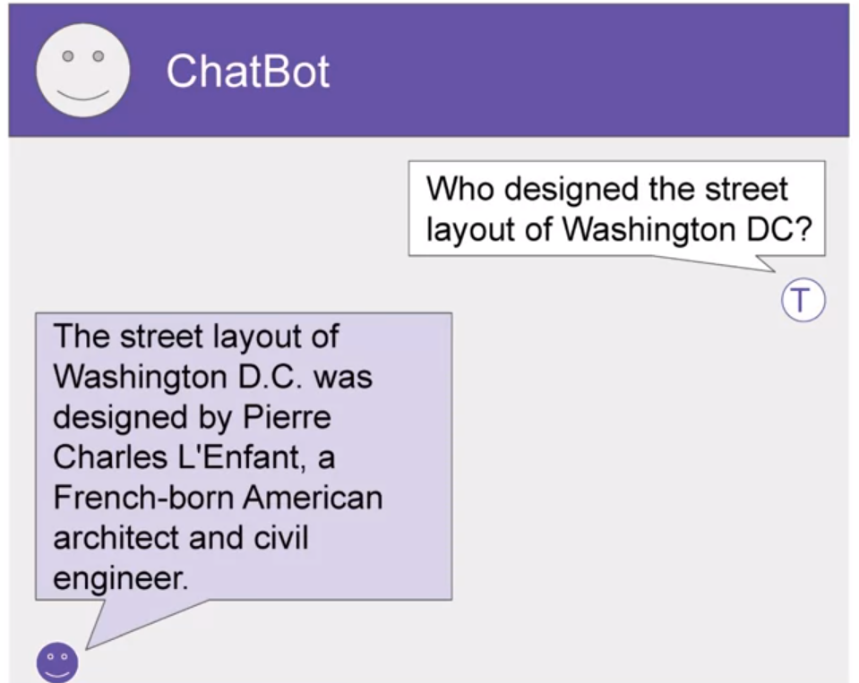
    2. `Generating images from text`
        - 
    3. `Using plugins to help you develop a code`
        - 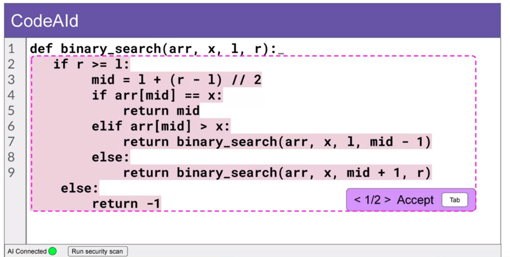

- Generative AI is a subset of traditional machine learning.

- **Different Large Language models**
    - Large language models have been trained in a trilions of words for many weeks and months with large number of computational resources.
    - These models will have billions of parameters.

    - 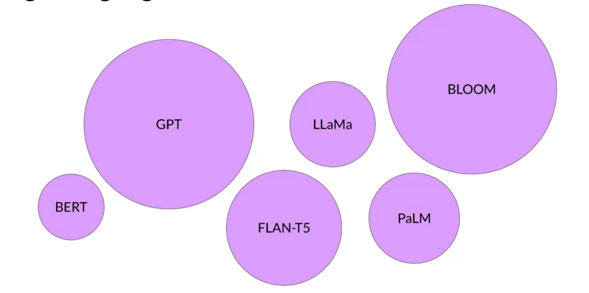

    - In lab we will cover FLAN-T5 via prompting and fine-tuning.


- **LLM inference**
    - The text you pass to an LLM is known as prompt
    - The length of the longest sequence of tokens that a LLM can use to generate a token is known as context window of a LLM
    - The output of the model is known as completion.
    - The act of using the model to generate text is known as Inference.
    - 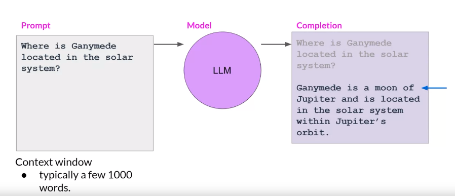


## LLM use cases and track
- Chatbot
- Easy Writer
- Summarization
- Language Translation
- Translate Natural Language to Machine Code
- Named Entity Recognition
- Retrieval Augmented Generation (RAG)
    - Useful to retrieve data from outside a foundation model and augments your prompts by adding the relevant retrieved information.

- `Instructor mentions as the size of the LLM increases the understanding of the Language by model will also increases.`

- These use cases are possible only because of the architecture that powers that them i.e. `transformer`.


## Text Generation before Transfomers
- Before Transformer architecture that arises in 2017, RNNs were used for generating text.

- Generative algorithms have been around for some time, but previous models like recurrent neural networks (RNNs) had limitations due to compute and memory requirements for generative tasks.


## Transformer Architecture
>> You can look [Jay Alammar "The illustrated transformer"](https://jalammar.github.io/illustrated-transformer/) for interactive visualizations.

- 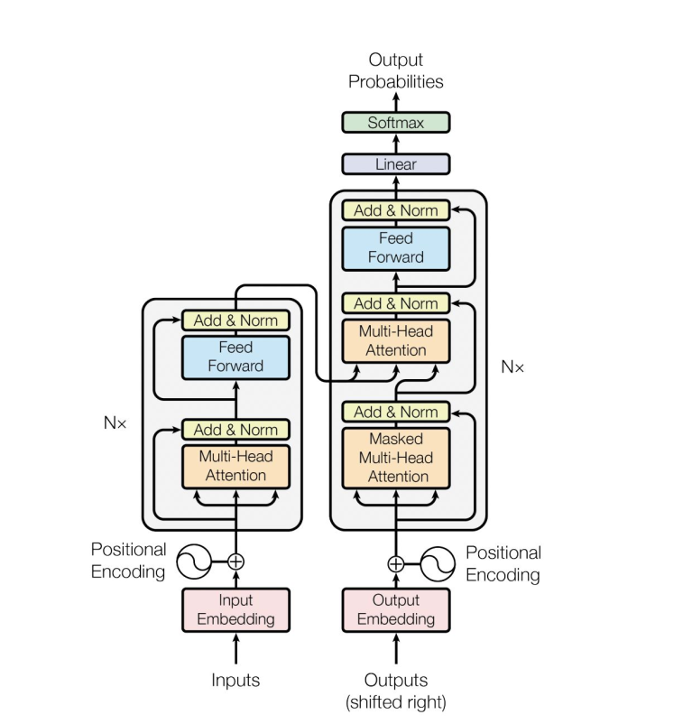  

 - The transformer architecture revolutionized natural language tasks, outperforming earlier RNN-based models and enabling powerful generative capabilities.

 - The two main problems of RNNs solved by Transformer architecture are:
    - Long-term dependencies
    - Parallelize Computation 

 - The key feature of transformers is self-attention, which allows the model to understand the relevance and context of all words in a sentence by applying attention weights to their relationships.

 - The transformer consists of two parts: the encoder and the decoder, which work together and share similarities in processing.

 - Text must be tokenized to represent words as numbers before passing it through the embedding layer, where each token is represented as a vector in a high-dimensional embedding space.

 - Positional encoding is added to preserve word order information during processing.

 - The self-attention layer has multiple heads that independently learn different aspects of language, such as relationships between entities or the activities in a sentence.

 - The output of the self-attention layer goes through a feed-forward network, and the final softmax layer produces probability scores for each word in the vocabulary.

 - The word with the highest probability score is the most likely predicted token, but various methods can be used to select the final output token.


 ## Generating text with transformers
 >> In this section you will see how generate sequence given sequence using transformer architecture (similar to machine translation original objective of the transformer architecture designers).

 - In the original transformer paper, they experiment on machine translation task i.e. translating french text to english text.

- `Instructor used below figure to explain the concepts:`
    - 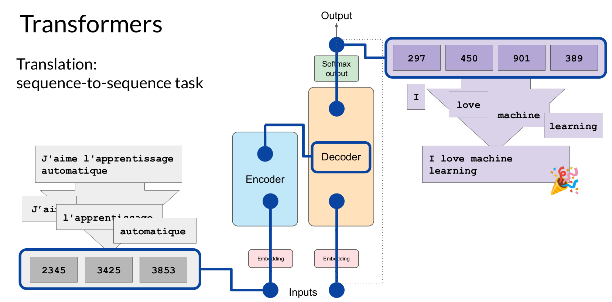

 - `Transformers Encoders Flow:`
    - Tokenize input text using same tokenizers that was used to train the network (i.e. Byte Pair Encoding or BPE)
    - The Tokenize inputs are passed through the embedding layers, that will map tokenize input id to embedding vectors via embedding lookup table.
    - The sum of generated embedding vectors and position encoding vectors are then passed to the first multi-headed attention layers in the Encoders side.
    - The output of the mult-headed attention networks are the passed to the feed-forward network.
    - In encoders side there are total of 6 (multi-headed attention + feedforward) blocks. So, the embedding vectors will be passed to all of the 6 blocks one by one and final contextualized vectors for each input tokens are generated in the outputs of encoder blocks. 
    - This final output vector is the deep representation of the structure and meaning of the input sequence.
    - This representation is inserted into the middle of the decoder to influence the decoder's self-attention mechanisms.

- `Transformers Decoder flow`
    - At decoder side, a start of sequence token is added to the input of the decoder.
    - This triggers the decoder to predict the next token, which it does based on the contextual understanding that it's being provided from the encoder.

    - Like Encoder, In Decoder there are also 6 blocks of mult-headed self attention plus feed forward blocks.
        - 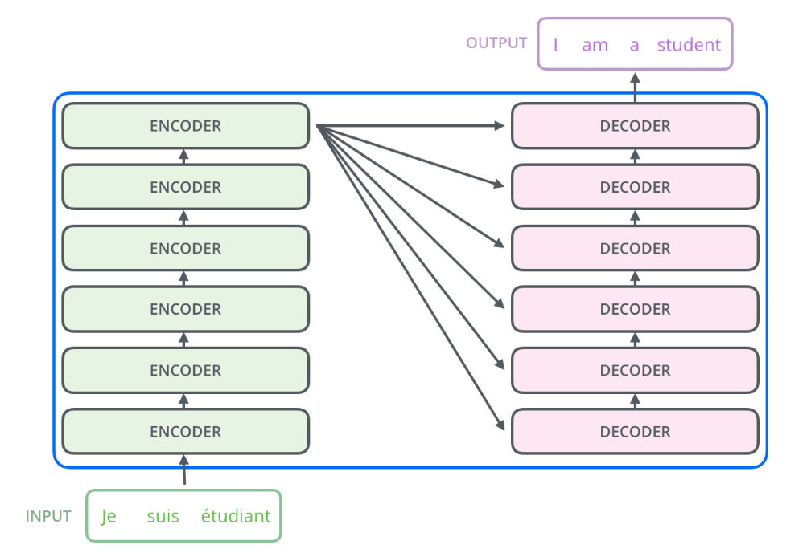  

        >>> **Source:** [The illustrated Transformer Blogs](https://jalammar.github.io/illustrated-transformer/)

    - Unlike Encoder, One block named  Encoder-Decoder attention is added in between mult-headed self attention and feed forward block to consider encoded input sequence information while translating the text. 
        - 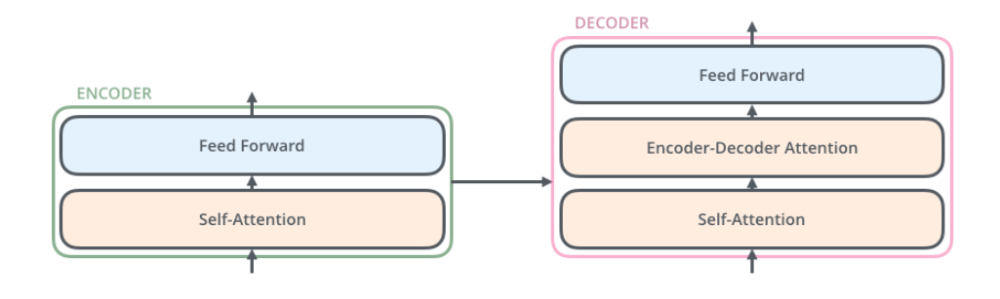  

        >>> **Source:** [The illustrated Transformer Blogs](https://jalammar.github.io/illustrated-transformer/)

    - After passing through all these decoder layers, the output vectors from final decoders layer is passed through the softmax layers, and we extract the tokens with highest probability, and hence we got our first translated tokens. 

    - In the next iteration previous input tokens along with predicted translated tokens is passed through the input of decoders, and we extract the next translated predicted tokens in the same manner.

    - This process is repeated until End of Sequence tokens is predicted by decoder.


### Modified Transformer
>> For translation tasks as seen before, you used both Encoder and Decoder part of the original transformer without any modification. Based on the use cases, we can modify original architecture and use either Encoder only models, Both Encoder-Decoder models, or Decoder only models.

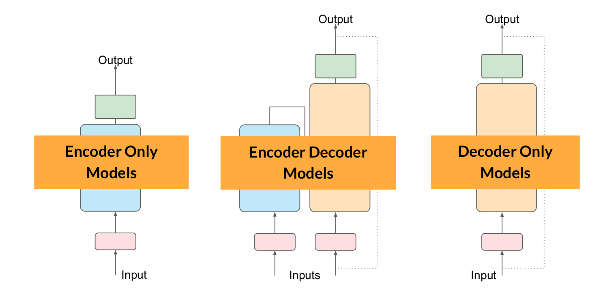

1. **Encoder only blocks**
    - Encoder models use only the encoder of a Transformer model.
    - These, models are useful for Natural language understanding tasks, i.e. understanding the input sequences.
    - They are often called as `auto-encoding models`.
    - The pre-training part is carried out by masking or corrupting given sequences (via `[MASK]`) and asking the model to find or reconstruct the original sentences.
    - We can add additional layers on the top of pretrained Encoder only models to perform different tasks such as:
        - sentence classification
        - named entity recognition
        - extractive question answering

    - Example models:
        - [ALBERT](https://huggingface.co/docs/transformers/model_doc/albert)
        - [BERT](https://huggingface.co/docs/transformers/model_doc/bert)
        - [DistilBERT](https://huggingface.co/docs/transformers/model_doc/distilbert)
        - [ELECTRA](https://huggingface.co/docs/transformers/model_doc/electra)
        - [RoBERTa](https://huggingface.co/docs/transformers/model_doc/roberta)

2. **Encoder-Decoder models**
    - Also called as `sequence-to-sequence models`.

    - Uses both Encoder and Decoder part of original Transformer architecture.

    - These architectures are useful for tasks where input needs to sequence and outputs also needs to be sequence such as:    
        - Summarization
        - Translation
        - Generative question answering

    - Example models
        - [BART](https://huggingface.co/docs/transformers/model_doc/bart)
        - [mBART](https://huggingface.co/docs/transformers/model_doc/mbart)
        - [Marian](https://huggingface.co/docs/transformers/model_doc/marian)
        - [T5](https://huggingface.co/docs/transformers/model_doc/t5)


3. **Decoder only models**
    - Uses only the Decoder of original Transformer architecture.
    - These models are called `auto-regressive models.`
        - Auto-regressive models is a techniques to predict the next word in a sequence of words based on the words that have come before it.

    - The pretraining tasks of Decoder only models is predicting the next word in the sentence.

    - Example models:
        - [GPT-4](https://paperswithcode.com/method/gpt-4)
        - [GPT-3](https://paperswithcode.com/method/gpt-3)
        - [GPT-2](https://huggingface.co/docs/transformers/model_doc/gpt2)
        - [GPT-1](https://huggingface.co/docs/transformers/model_doc/openai-gpt)


_**At this point, I want you to encourage to take look at [Jay Alammar "The illustrated transformer"](https://jalammar.github.io/illustrated-transformer/) for interactive visualizations.**_


## Prompting and Prompt Engineering
- The text you fed into the model is called `prompt`.
- The act of generating text is called `inference`.
- The output text is know as `completion`.
- The length of the longest sequence of tokens that a LLM can use to generate a completion token is known as context window of a LLM.
- Prompt Engineering  is the practice of crafting effective queries or inputs referred to as prompts to guide AI to deliver the most accurate and useful answer.
- For the good answer, we generally add examples inside the prompt that helps LLMs to generalize based on the provided examples. Hence, providing examples inside the context window or prompts is called as `incontext-learning`

- Instructor talks about 3 different scenarios:
    1. `Zero Shot Inference`
    ```
    > Here no example is provided in the prompt
    Classify this review:
    I loved this movie!
    Sentiment:
    ```

    2. `One Shot Inference`
    > Here one example is provided in the prompt.
    ```
    Classify this review:
    I loved this movie!
    Sentiment: Positive

    Classify this review:
    I don't like this chair.
    Sentiment:
    ```

    3. `Few Shot Inference`
    > Here few examples are provided in the prompt
    ```
    Classify this review:
    I loved this movie!
    Sentiment: Positive

    Classify this review:
    I don't like this chair.
    Sentiment:  Negative

    Classify this review:
    Who would use this product?
    Sentiment: 
    ```

**`As per the Instructor, Largest models are good at zero-shot inference with no examples, where as Smaller models can benefit from one-shot or few-shot inference. You need to go for fine-tuning if your model is not performing well even with 5 or 6 examples.`**


## Generative Configuration (Inference parameters)
>> Here we'll see some of the configuration parameters that we can adjust to make the Large Language Models perform better. These configurations parameters are different from training parameters and contribute to make inference result better, allowing users to control various aspects of the text generation process.

- **`Max new tokens`**
    - Limits the number of tokens that the model will generate.
    - Example:
        - max_new_token = 100. We are asking model to generate max of 100 tokens. Here, it is not necessary that model will always generate 100 tokens, because if model generate stop token in advance before reaching 100 tokens, the generation process stops. In this case generated tokens can be less than 100.

- **`Greedy Decoding`**
    - In final layer of LLMs architecture, there is a softmax layer, which outputs the probability distribution of all the words present in the Vocabulary.
    - Most LLMs by default will operate with greedy decoding.
        - Simplest form of decoding where model always choose the word with highest probability.
        - Suitable for short generations.
        - can include repeated words in the generations.
    - `Example:`
        ```
        cake: 0.20
        donut: 0.10
        banana: 0.02
        apple: 0.01
        ....  ......

        In Greedy Decoding, the models output the words with highest probability scores i.e. cake in this case.
        ```

- **`Random Sampling`**
    - Introduces variability by randomly selecting words based on their probability distribution.
    - This allows for more natural and diverse text generation.
    - However, it can also lead to outputs that may not make sense or wander off into unrelated topics.
    - `Example: `
        ```
        cake: 0.20
        donut: 0.10
        banana: 0.02
        apple: 0.01
        ....  ......

        In Random Sampling, the models output the words by sampling based on the probability scores.
        - here, chances of occuring cake is 20%
        - chances of occuring donut is 10%
        - chances of occuring banana is 2%
        - chances of occuring apple is 1% and so on.

        So, in this case, model could outputs apple as well although it has less probability score.
        ```
         
- **`Sample top K`** 
    - With "Sample Top k", you specify a value k, and the model randomly samples from the top k tokens with the highest probabilities.
    - `Example: `
    ```
    cake: 0.20
    donut: 0.10
    banana: 0.02
    apple: 0.01
    ....  ......

    Let, K = 2

    Top K words: cake(0.20), and donut(0.10)

    Random Sample between cake(0.20), and donut(0.10) with,
    
        - 20% of chances of selecting cake
        - 10% of chances of selecting donut 
    ```

- **`Sample top P`**
    - With "Sample Top p", you specify a probability threshold p, and the model only considers tokens whose cumulative probability mass is less than or equal to p.
    - select an output using the random-weighted strategy with the top-ranked consecutive results by probability and with a cumulative probability <= p.

    - `Example: `
    ```
    cake: 0.20
    donut: 0.10
    banana: 0.02
    apple: 0.01
    ....  ......

    if p = 0.30

    Now, The options are words, cake (0.20) and donut (0.10) since (0.20 + 0.10 <= 0.30)

    Next, The model choose next words via random sampling between cake (0.20) and donut (0.10) i.e.
        - 20% of chances of selecting cake
        - 10% of chances of selecting donut

    ```

- **`Temperature`**
    - Range: 0 to positive inifinity.
    - You can visit [this site](https://lukesalamone.github.io/posts/what-is-temperature/) to play with the temperature.
    - The softmax function with temperature (θ) is defined as:  

    - $$
       \sigma(z_i) = \frac{e^{z_i / \theta}}{\sum_{j=1}^{N} e^{z_j / \theta}}
      $$

        - where,  
            - $\sigma(z_i)$ represents the logits for the i-th element in the input vector z.
            - N, is the total number of elements in the input vector z

    - `High Temperature (e.g. T > 1.0)`
        - Makes output more random and diverse.
        
    - `Medium Temperature (e.g. T close to 1.0)`
        - Balances randomness and determinism.

    - `Low Tempearture (e.g. T < 1.0)`
        - output more focused and deterministic.

    - `Cooler Temperature vs Higher Temperature`
        - 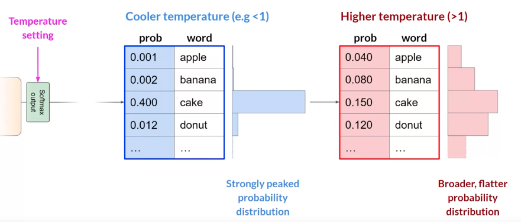
        - When Temperature is low, we can see less variability distribution with single peak at word **cake** i.e. less randomness
        - When Temperature is high, we can see more variable distribution i.e. Broader, flatter probability distribution meaning more randomness.

_**`Higher the temperature, Higher the randomness. Lower the temperature, Lower the randomness.`**_


## Generative AI project lifecycle
> In this section Instructor highlights the overall Generative AI project lifecycle starting from Project Scoping to Project Integration.

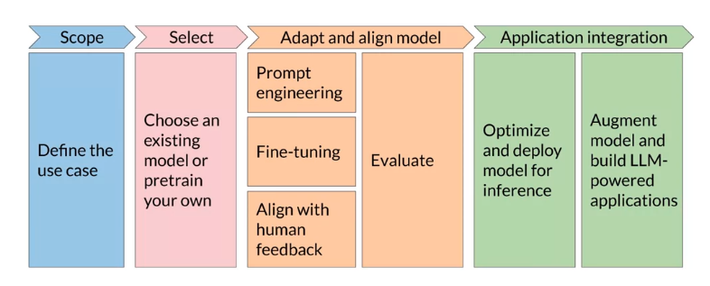

- **Scope(Define the use cases)**
    - LLMs can do a variety of tasks.
    - LLMs abilities depends on the size and architecture of the model. 
    - Big models are good at performing variety of tasks as they have seen more data and trained on big architecture with large compute resources. However small models are good at performing small or subset of tasks.
    - You need to decide what LLMs can be used in your applications use cases
        - Choose Large models to Perform many tasks i.e Essay Writing, Summarization, Translation, Information retrieval (NER), Invoke APIs and actions.
        - Choose Small models to perform single tasks i.e. Information retrieval (NER).   
    

- **Select LLM**
    - LLM can be used as: 
        - `Inference` via existing model
        - `FineTune` an existing model
        - `Pretrain` your own

    - In general you can start via model inference and test it via prompting, then you can move towards the steps of FineTuning on custom data, or even Pretraining your own LLMs from scratch.

    - Choice of LLMs depends on 
        - The variety of task you wish to perform. 
        - Available compute resources you have.
        - Licence (commercial, research, non-comercial)
        - [LLM LeaderBoard](https://huggingface.co/spaces/HuggingFaceH4/open_llm_leaderboard)


- **Adapt and align model**
    - Once you have choosed your model, Next step is to assess its performance and carry out additional training if needed for your application.
    - Instructor suggests to start from Prompt engineering via in-context learning, switch to Finetuning if in-context learning doesn't works, finally you can shift towards additional fine-tuning technique called reinforcement learning with human feedback.
    - In order to evaluate the models (How well your model is performing?) you can rely on different metrics based on the specific tasks (Example: ROUGE score for summarization.)

 _**`Adapting and Evaluating process is Highly Iterative i.e. Start with sample prompt evaluate the result. Based on the evaluation result go back to prompt-tuning or even fine-tuning and again evaluate the model unless you reach to certain evaluation threshold.`**_

 - **Application Integration**
    - Two ways:
        1. Optimize and deploy model for inference
            - Directly host or deploy your model into your infrastructure for inference.
            - Here, you need to optimize your model via techniques such as quantization, so that you can make best use of your compute resources with best user experiences. 

        2. Augment model and build LLM-powered applications


## Introduction to AWS labs
> This course encourages hands-on learning via several lab exercises to solidify concepts. In first week you will do the `dialogue summarization task` using generative AI.  You will explore how the input text affects the output of the model, and perform prompt engineering to direct it towards the task you need.

- The lab environment called `Vocareum` provides access to Amazon SageMaker through an AWS account at no cost to the learners.
    - [Vocareum](https://www.vocareum.com/) is an online platform that provides cloud-based learning environments students and learners. It is commonly used in educational settings like online courses and workshops, to provide hands-on learning experiences without the need for learners to set up their own local environments. 
- Learners can access the labs in Vocareum, launch the AWS console, and open SageMaker Studio, a jupyter-based IDE for running notebooks.
- Learners are guided step-by-step on how to access the labs, open the terminal, and copy the necessary code from a public S3 bucket.

_**`Note: If you are auditing the course, then you will not be able to access the lab environments.`**_
