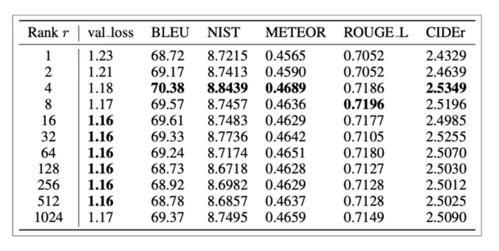

## Introduction
>> This weeks covers Fine-tuning and evaluation of large language models
- Explain how fine-tuning and instruction prompt dataset can improve performance on one or more tasks.
- Define catastrophic forgetting and explain techniques that can be used to overcome it.
- Define the term Parameter-efficient Fine Tuning (PEFT).
- Explain how PEFT decreases computational costs and overcomes catastrophic forgetting.

##  `Instruction Fine-Tuning:`

- When base large language model is created using lots of internet data, the trained model will know lots of information about text. But such Base model doesn't know how to responds to a certain questions based on prompt. Hence, we will Fine-tune the base model with Instruction related datasets that can understand the prompt passed by the user and responds accordingly.

- Instruction Fine-Tuning is useful because:
    - In-context learning may not work for smaller models.

    - Including examples via few-shot learning may leads to increase in context size of many LLMs.

    - when large language model can't answered to user prompt with optimal responds via in-context learning (one/few shot examples prompt).

- Instruction Fine-Tuning is a supervised learning i.e. given input prompts we will instruction fine-tune LLMs to output completion of the input prompts.

- `Full fine-tuning` updates all of the model parameters.
    -  Similar to Pre-training, Full fine-tuning may need enough memory and budget for training, since we are training all of the layers.


- **Instruction Fine-Tuning Steps:**
    1. Prepare the training datasets
        - several publicly available dataset like [alpaca](https://huggingface.co/datasets/tatsu-lab/alpaca)
        - 
    2. Training Splits 
        - Divide the datasets into training, validation, and test splits
    
    3. Modeling
        - Fine-Tune pre-trained LLMs with training split.
        - Validate and perform hyperparameter tuning with Validation split.
        - [Crossentropy Loss](https://wandb.ai/sauravmaheshkar/cross-entropy/reports/What-Is-Cross-Entropy-Loss-A-Tutorial-With-Code--VmlldzoxMDA5NTMx) is used as loss or objective function since `LLMs` outputs a probability distribution accross tokens from the Vocabulary.
        - Now, updates the model weights via Backpropagating Crossentropy loss function.
        - Finally, test instruction fine-tuned LLMs with test split, Compare model prediction and true output.

- Fine-Tuning original base model leads to newer version of model known as `instruct model`

- 


## Fine-tuning on a single task
- Fine-tuning on a single task is useful when there may arise situation when you to perform a single task like summarization, question answering, etc i.e. only the interested tasks.
- Generally, 500 to 1000 training examples can results into somewhat good model, However larger training samples leads to the optimal results.

- Author mentioned about the term `Catastrophic forgetting` which means the full-fine tuning process modifies the weights of the original llm. 
    - Leads to great performance on Fine Tuned Task (single task)
    - Degrades performance on other task (multiple task)

- For better generalization capability of model on multiple task, you can fine-tune on multiple tasks at the same time.
    - Good, multi-task fine-tuning may require 50,000 to 1,00,000 accross many tasks.
    - i.e. more data and more computation power to train

- Author also discussed about `PEFT (Parameter Efficient Fine-tuning)` instead of Full-Fine Tuning
    - PEFT preserves the original weight of the LLMs and train only a small number of task-specific adapter layers and parameters
    - Greater robust to catastrophic forgetting since most of the pre-trained weights are left unchanged.


## Multi-task instruction fine-tuning
> Extension of single task fune-tuning where training examples consisits example inputs and outputs for multiple tasks

- Dataset can consists of variety of tasks such as `summarization`, `Translation`, `NER`, etc.

- Generally the model is fine-tuned on these types of mixed datasets in order to improve the performance of the model on all of the mentioned tasks.

- **Cons:**
    - It requires a lot of data for fine-tuning, you may need around 50000 to 100000 or even greater. (As per instructor it is worth of gathering such large data, since final fine-tuned model will be of good performance)

- `FLAN` family of models are trained using mult-task instruction fine-tuning  dataset.
    - FLAN models refer to a specific set of instructions used to perform instruction fine-tuning.
    - FLAN stands for `Fine-Tuned Language Net`
    - Example: 
        - FLAN-T5 is T5 version fine-tuned on FLAN instruction set.
        - FLAN-PALN is the FLAN instruct version of the palm foundational model.

- As Discussed, FLAN-T5 is the Fine-tuned version of base T5 which is fine-tuned accross 473 datasets accross 146 task categories.
- 

    - `Datasets:` It is an original data source   
    - `Categories:` a single datasets can include   multiple task categoriesm  
    - `Task:` it's a unique <datset, task_category> pair.

- Instructor highlighted `samsum` datasets that is used to train model to improve dialogue summarization capability. You can look below for example datset:


| Dialogue (string)                            | Summary (string)                                    |
|----------------------------------------------|------------------------------------------------------|
| "Amanda: I baked cookies. Do you want some ? Jerry: Sure! Amanda: I'll bring you some tomorrow :-)" | "Amanda baked cookies and will bring Jerry some tomorrow." |

- **Samsum Data Link:** [Click Here](https://huggingface.co/datasets/samsum)

- Samsum is also the part of FLAN instruction set.

- `Sample FLAN-T5 prompt templates`
    - 
    - As we can see, instruction to ask LLM to summarize are slightly different in different simples, this helps LLM to generalize better.

- To further improve T5's summarization capabilities it can be further fine-tuned with a domain specific instruction dataset like [dialogsum dataset](https://huggingface.co/datasets/knkarthick/dialogsum/viewer/default/train?row=0)


- Instructor mentioned, Summary before fine-tuning FLAN-T5 with our dataset is not that good as compared to fine-tuning FLAN-T5 with dialogsum dataset that matches summarization similarly to that of human generated.

_`How to evaluate how well our model performed?`_


## Model Evaluation

- **Traditional Machine Learning** 
    - In supervised setting, there are several evaluation metrics i.e.
        - `Accuracy`
            - $Accuracy=\frac{Correct Predictions}{TotalSamples}$

- **Large Language Models**
    - Unlike traditional machine learning, Evaluation of LLM might be challenging since Output is textual data and non-deterministic.
    - Instructor highlights the following examples:
    
        ```
        1. "Mike really loves drinking tea" is equivalent to "Mike adores sipping tea."  


        2. "Mike does not drink coffee" is not equivalent to "Mike does drink coffee"
        ```
    - With this example, we can see that even change in a single word would completely changes the meaning of text. Also there are many similar words to particular word, for example `loves` is equivalent to `adores`. This lead to several challenges in evaluating text based models or Large Languge Models.

    - There are two popular metrics named `ROUGE` and `BELU ` score in evaluating text based models.

    - **unigram vs bigram vs ngram**   
        - `unigram: ` Equivalent to 1 word
        - `bigram: ` Equivalent to 2 words
        - `ngram: ` Equivalent to group of n-words

            ```
            Text: Large Language Models are awesome

            1. unigrams: ['Large', 'Language', 'Models', 'are', 'awesome']

            2. bigrams: ['Large Language', 'Language Models', 'Models are', 'are awesome']

            3. trigrams: ['Large Language Models', 'Language Models are', 'Models are awesome']
            ''''''''''''''''''''''''''''''''''''''''''''''''''''''''''''''''''''''''''''
            ''''''''''''''''''''''''''''''''''''''''''''''''''''''''''''''''''''''''''''
            ''''''''''''''''''''''''''''''''''''''''''''''''''''''''''''''''''''''''''''            
            ```
        - `Why ngrams?`
            - Consider chunk from the above text "Large Language Models"
            - In unigram single word is considered (Large, Language, Models),
            - In bigram pair of words are considered (Large Language, Language Models)
            - In trigram three words are considered  (Large Language Models).
            - So for the above chunk using trigram we are able to retain the true meaning. 
            - However there may be scenario where chunk meaning can be retained by unigram (e.g. word apple), or bigram (e.g Rouge Score), or trigram (e.g. Large Language Models) and so on.
            - This why we need to consider ngrams.  

     - **ROUGE SCORE**  
        - ROUGE stands for Recall-Oriented Understudy for Gisting Evaluation.
        - Commonly used metrics for text summarization, but can also be used for machine translations task as well.
        - `Idea:` To compare a model generated summary to one or more huma generated reference summaries.  
        - I would like you to redirect to [this blog post](https://www.freecodecamp.org/news/what-is-rouge-and-how-it-works-for-evaluation-of-summaries-e059fb8ac840/) for detailed study.
        - Based on unigrams, bigrams, trigrams, or ngrams, ROUGE score can be cateogrized into ROUGE-1, ROUGE-2, ROUGE-3, or ROUGE-N.
        - We can understand ROUGE score interms of precision and recall, So if we consider unigram, then
            - $ROUGE-1 (Precision) = \frac{UnigramMatches}{UnigramsInOutput}$

            - $ROUGE-1 (Recall) = \frac{UnigramMatches}{UnigramsInReference}$

        - For Bigram, 
            - $ROUGE-2 (Precision) = \frac{BigramMatches}{BigramInOutput}$

            - $ROUGE-1 (Recall) = \frac{BigramMatches}{BigramInReference}$
        
        - Similary, for ngram
            - $ROUGE-n (Precision) = \frac{ngramMatches}{ngramInOutput}$

            - $ROUGE-n (Recall) = \frac{ngramMatches}{ngramInReference}$
        - If we get precision and recall, we can compute F1-score using harmonic mean of precision and recall.
            - $F1(score) = \frac{2*Precision*Recall}{Precision+Recall}$

        - `ROUGE-L`
            - It measures the longest common subsequences(LCS) between our system output and reference.
            - Key idea is to count the longest sequence of tokens that is shared between the both. This is because, longer shared sequence would indicate more similarity between the two sequences.
            - $ROUGE-L = \frac{LCS (R, S)}{UnigramsInReference}$
                - Reference Text: It is cold outside
                - System Text: It is very cold outside
                - LCS: 2 (because It is, and cold outside is the longest sequence whose length is 2)

        - **`Example:`**  
                
            ```
            Reference (human):
            It is cold outside.
            unigrams: [It, is, cold, outside]
            bigrams: [It is, is cold, cold outside]

            System output:
            It is very cold outside
            unigrams: [It, is, very, cold, outside]
            bigrams: [It is, is very, very cold, cold outside]

            ROUGE-1 (Recall)    = unigram_matches / unigram_in_reference
                                = 4 / 4 = 1
            ROUGE-1 (Precision) = unigram_matches / unigram_in_system
                                = 4 / 5 = 0.8
            ROUGE-1 (F1)        = 2 * precision * recall / precision + recall
                                = (2*0.8*1)/(0.8+1) = 0.89

            
            ROUGE-2 (Recall)    = bigram_matches / bigram_in_reference
                                = 2 / 3 = 0.66
            ROUGE-2 (Precision) = bigram_matches / bigram_in_system
                                = 2/4 = 0.5
            ROUGE-2 (F1)        = 2 * precision * recall / precision + recall
                                = (2*0.5*0.66)/(0.5+0.66) = 0.568

            **LONGEST COMMON SUBSEQUENCE**
            ROUGE-L (recall)     =  LCS(S, R) / unigram_in_reference
                                 = 2 / 4 = 0.5

            ROUGE-L (precision)  =  LCS(S, R) / unigram_in_system
                                 = 2 / 4 = 0.5
            ```                 
        - **`Cons:`**
            - ROUGE Score may be high, even model generate same words repeatedly,
                ```
                Reference (Human):
                It is cold outside

                System output:
                cold cold cold cold


                ROUGE-1 (Precision)  =  unigram_matches/unigrams_output
                                     = 4 / 4 
                                     = 1


                Solution --> Modified Precision
                Modified Precision   = clip (unigram_matches) / unigrams_output
                                     = 1 / 4 
                                     = 0.25
                ```
        - For Python ROUGE Implementation: [click_here](https://pypi.org/project/rouge-score/)


    - **BLEU SCORE**
        - BLEU stands for `Bi-Lingual Evaluation Under Study`.
        - Commonly used metrics for text translation task.
        - `Idea:` To compare a model generated translation to one or more human generated reference translation.
        - BLEU metric = Avg(precision across range of n-gram sizes)
        - BLEU Score by Andrew NG: [click_here](https://www.youtube.com/watch?v=DejHQYAGb7Q)
        - For quick calculation of BLEU score, please vist [this blog](https://huggingface.co/spaces/evaluate-metric/bleu) post by HuggingFace

    - Choice of evaluation metrics, always depends on the task that you are trying to solve. As discussed, for summarization task ROUGE score is used, for Machine Translation or Image Captioning task, BLEU score is used.


## Benchmarks
- There are several LLMs that are evolving on a daily basis. So in order to compare the performance of these LLMs, we need some open source pre-existing datsets, which are called Benchmarks dataset. 
- These pre-exsiting datasets are created via LLM researcher specifically for comparing  the performance of  several LLMs.
- Different Bechmarks are:
    - GLUE
        - Stands for General Language Understanding Evaluation Benchmark
        - It consists of datasets about whether the premise entails the hypothesis (entailment), contradics the hypothesis (contradiction), or neither (neutral) i.e. Natural Language Inference.
        - HuggingFace data Link: [Click Here](https://huggingface.co/datasets/glue)
    - SuperGLUE
        - SuperGLUE is a new benchmark styled after GLUE.
        - HuggingFace daa link: [click Here](https://huggingface.co/datasets/super_glue)
    - HELM
        - stands for Holistic Evaluation of Language Models (HELM)
        - Recommended Read: [click_here](https://huggingface.co/blog/evaluating-mmlu-leaderboard)
    - MMLU (Massive Multitask Language Understanding)
        - It is multiple choice question test benchmark dataset.
        - Covers 57 tasks including elementary mathematics, marketing, Public Relations, and more.
        - It is designed specifically for modern LLMs.
        - As per paper, To attain high accuracy on this test, models must possess extensive world knowledge and problem solving ability.
        - HuggingFace Data Link: [Click Here](https://huggingface.co/datasets/lukaemon/mmlu)
        - Paper Link: [Click Here](https://arxiv.org/abs/2009.03300)
    - BIG-bench
        - You can visit [this github repo](https://github.com/google/BIG-bench/blob/main/bigbench/benchmark_tasks/README.md) for task name and description.


## Parameter Efficient Fine-Tuning (PEFT)

- Training LLM is computationally inefficient
- Full-fine tuning requires memory not only to store the models but there may be various other parameters required in training process like optimizer parameters, gradients etc
- While training LLMs, You need to allocate memory for:
    - Forward Activations
    - Gradients
    - Optimizer States
    - Trainable weights
    - Other temporary memory
- In contrast to full-finetuning where every model weight is updated during supervised learning, parameter efficient fine-tuning method only update a small subset of parameters.
- Idea is to freeze most of the model weights and focus on fine-tuning a subset of existing model parameters (e.g particular layers or components)
- Another idea is to add new layer on top of pre-existing layers and only train the newly added layers.
- In PEFT, most of the LLMs weights are kept frozen, this ways the trainable parameter while finetuning will be reduced compared to that of original LLMs.
    - Generally, it consists of only 15-20% of original LLMs weights in order to train.
- PEFT can often be performed on a single GPU, and PEFT is less prone to catastrophic forgetting since only some layers are fine-tuned keeping weights of layers of original LLMs same.

- Full Fine-tuning  creates full copy of original LLM per task, i.e.
    - For Q&A fine-tune, we get Q&A LLM
    - For summarization fine-tune, we get Summarization LLM
    - For Generation fine-tune, we get Generation LLM

- With PEFT,
    - you train only a small subset of weights, and new weights are combined with the original LLM weights for inference.
    - In contrast to Full Fine-tuning, PEFT requires to train the model weights in the scale of MB's.

- 3 main PEFT Methods:
    - `Selective Method`
        - It fine-tune only a subset of original LLM parameters.
        - There are several approaches in identifying which parameters you want to update.
        - Here, you have the option to train only certain component of the model or specific layers, or even individual parameters types.
        - This method is not cover in this course.
    - `Reparameterization method`
        - It also work with the original LLM parameters but reduce the  number of parameters  to train by creating new low rank transformations of the original network weights.
        - Commonly used techniques of these type is LORA.
    - `Additive Method`
        - It carry out fine-tuning keeping all of the LLM weights frozen and introducing new trainable components.
        - Two main approaches,
            - Adapter methods: 
                - adds new trainable layers to the architecture of the model, typically inside the encoder or decoder components after the attention or feed-forward layers.
            - Soft prompts: 
                - keep the model architecture fixed and frozen.
                - Focuses on manipulating the input to achieve better performance.
                - Can be performed by adding trainable parameters to the prompt embeddings or retraining the embedding weights.
                - This course covers specific soft prompts methods called `Prompt Tuning`.


- Instruction HIghlights the following trade-offs when considering different PEFT methods   i.e.
    - Memory Efficiency
    - Parameter Efficiency
    - Training Speed
    - Inference Costs
    - Model Performance
    - Memory Efficiency


- `PEFT Summary:`
    - Performing full-finetuning can lead to catastrophic forgetting because it changes all parameters on the model. Since PEFT only updates a small subset of parameters, it's more robust against the catastrophic forgetting effect.
    - PEFT methods attempt to address some of the challenges of performing full fine-tuning process:
        - Because most parameters are frozen, we typically only need to train 15%-20% of the original LLM weights, making the training process less expensive (less memory required)
        - With PEFT, most parameters of the LLM are unchanged, and that helps making it less prone to catastrophic forgetting.
        - With PEFT, we can change just a small amount of parameters when fine-tuning, so during inference you can combine the original model with the new parameters, instead of duplicating the entire model for each new task you want to perform fine-tuning.
        

## PEFT Techniques (LORA)
- stands for Low Rank Adaptation
- parameter efficient fine-tuning technique that falls into the re-parameterization category.
- Instructor gave high level overview of transformer architecture as a revision.
- During full-fine tuning every parameters in the network is updated whereas LORA is a strategy that reduces the number of parameters to be trained during fine-tuning by freezing all of the original model parameters and then injecting a pair of rank decomposition matrices alongside the original weights
- Now we train the weights of smaller matrices

- High Level Steps:
    - Freeze most of the original LLM weights.
    - Inject 2 rank decomposition matrices.
    - Train the weighs of the smaller matrices using the same supervised learning technique

- Steps to update model for inference
    1. For inference two Low Rank matrices are multiplied together to create a matrix with the same dimensions as the frozen weights.
        - B * A = B x A
    2. Next step is to add this weights to the original weights and replace them in the model with these updated weight values.
    3. You now have the LORA fine-tuned model that can carry out your specific tasks. Because these models has the same number of parameters as the original there is little to no impact on the inference latency. 

- Researchers has found that to apply the LORA just before the self-attention layers of the model is often enough to fine-tune a task in the cheap performance gain. Researchers suggest to apply LORA i.e. decomposition matrices in self-attention layers.

- However you can also apply the LORA in other model architectures as well. However most of the LLMs are parameters are in the attention layers, you get the biggest savings in trainable parameters by applying LORA to these weights matrices


- **Example: (Using Transformer Architecture)**
    - As per the transformer paper, Transformer weights have dimensions of `d x k = 512 x 64`.
        - where, d = maximum number of tokens, k = embedding vector.
    - So each weight matrices has 512 x 64 = 32,768 trainable parameters.
    - So, In LORA with rank r = 8:
        - we will instead train two small rank decomposition matrices whose small dimension is 8. 
            - This means, 
                - matrix A has dimensions of r x k = 8 x 64 = 512 parameters.
                - matrix B has dimension of d x r = 512 x 8 = 4096 trainable parameters.
        - So by updating the weights of this new low rank matrices instead of original model weights, you will be training 4608 parameters instead of 32,768 parameters, This is around 86% reduction in parameters to train.

- Since LORA helps to reduce the trainable parameters drastically, it allows us to fine-tune the model using single GPU instead of clusters of GPU's.
- You can train different rank decomposition matrices for different tasks and update weights before inference.
    - Suppose you train a pair of LORA matrices for a specific tasks, say Task A.
    - To carry out inference on this task, say Task A, 
        - You multiply these matrices together and then add the resulting matrix to the original frozen weights.
        - You then take this summed weights (frozen weights + LORA weights) and replace it with the original model weights to carry out the inference on this task A. 

    - Assume, you want to perform inference on different task, say Task B.
        - you simply take the LORA matrices calculated for this task.
        - calculate their product and then add then add the original weights, Finally update the model again.
        - The memory required to update these LORA matrices are very small.

    
- Instructor discussed about difference between full-finetuning vs LORA fine-tuning, and performed the comparison using ROUGE metrics for Dialog Summarization (FLAN-T5).

```
Task: Dialog Summarization
Model: FLAN-T5

1. Base Model
ROUGE1 --> 0.2334
ROUGE2 --> 0.0760
ROUGEL --> 0.2014

2. Full Fine-Tune (Instruction based)
ROUGE1 --> 0.4216
ROUGE2 --> 0.1804
ROUGEL --> 0.3384

3. LORA fine-tune 
ROUGE1 --> 0.4081
ROUGE2 --> 0.1633
ROUGEL --> 0.3251

Note:
- LORA achieves performance improvement over the base model but not greater than the Full Fine Tuned model.
- However Full Fine Tuning has a larger number of trainable parameters as compared to LORA, and this means we need large computing power when using Full Fine Tuning as compared to LORA.
```

- Choosing good rank of matrices when using LORA is the active area of research. 
    - `smaller the rank, smaller will be the trainable parameters`.

- [LORA](https://arxiv.org/abs/2106.09685) paper highlighted the impact of model performance on language generation task with the choice of different rank as shown below:

-   

    - Increasing the Rank, authors founds the plateau.
    - This means using larger LORA matrices didn't improve the performance of the model.
    - Instructor mentioned rank betwen 4 to 32 could be the good choice.


## PEFT Techniques (Soft Prompts)
- We will look into specific soft prompts techniques called Prompt Tuning.
- Prompt Tuning is not Prompt Engineering, although they sound quite similar.
    - In `prompt engineering` you work on the language of your prompt to get the desired completion. Example: playing with different words, special tokens used in model to make model understand your input prompt, trying one-shot or few-shot inference and so on.
     - In `prompt tuning`


## Key Takeaways
- We discussed on:
    - how to adapt a foundation model through a process called instruction fine-tuning.
- We looked into some of the prompt templates and data sets that were used to train the FLAN-T5 model. 
- We discussed on different evaluation metrics like BLEU score and ROUGE score and different Benchmarks like HELM, GLUE, etc.
- We discussed on comparison between no fine-tuning vs full fine-tuning vs PEFT, and came to conclusion that using PEFT model performance is quite similar to that of full fine-tuning wit.
- With just a few hundred of examples you can fine-tune a model to your specific tasks.
- We also discussed how PEFT reduces the model parameters while performing fine-tuning.
- We discussed to techniques for PEFT i.e. LORA, and Prompt Tuning.
- when you combine LORA with the Quantization techniques to further reduce the memory footprint, This is known as Q-LORA.
- In practice PEFT is used heavily to minimize compute and memory requirements.


## Lab Summary
- In this week's lab instructors deep dive into full fine-tuning and parameter efficient fine tuning (PEFT) with prompt instructions.
- Model used: FLAN-T5
- Task: Text Summarization
- Dataset: [HuggingFace DailogSum](https://huggingface.co/datasets/knkarthick/dialogsum)
- Evaluation Metric: ROUGE SCORE
- Libraries:
    - torch
    - transformers
        - AutoModelForSeq2Seq, AutoTokenizer
    - datasets
    - rouge_score
    - loralib
    - peft
    - numpy
    - pandas