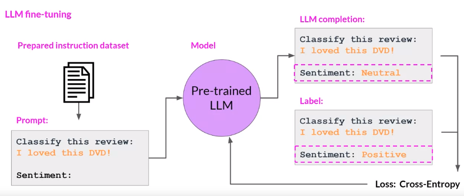
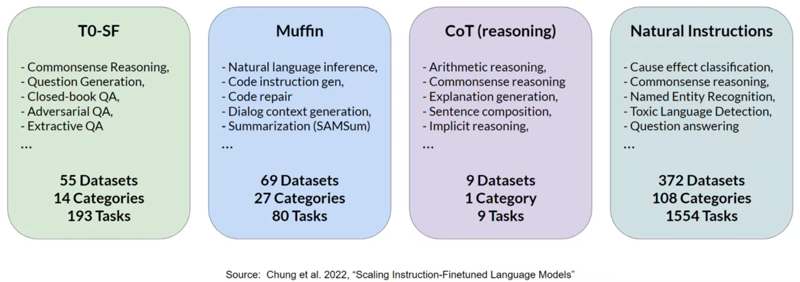
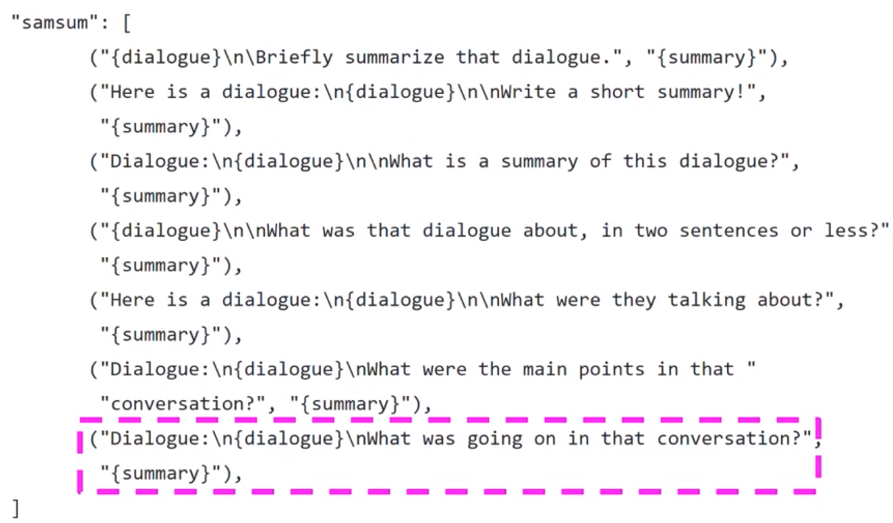

## Introduction
>> This weeks covers Fine-tuning and evaluation of large language models
- Explain how fine-tuning and instruction prompt dataset can improve performance on one or more tasks.
- Define catastrophic forgetting and explain techniques that can be used to overcome it.
- Define the term Parameter-efficient Fine Tuning (PEFT).
- Explain how PEFT decreases computational costs and overcomes catastrophic forgetting.

##  `Instruction Fine-Tuning:`

- When base large language model is created using lots of internet data, the trained model will know lots of information about text. But such Base model doesn't know how to responds to a certain questions based on prompt. Hence, we will Fine-tune the base model with Instruction related datasets that can understand the prompt passed by the user and responds accordingly.

- Instruction Fine-Tuning is useful because:
    - In-context learning may not work for smaller models.

    - Including examples via few-shot learning may leads to increase in context size of many LLMs.

    - when large language model can't answered to user prompt with optimal responds via in-context learning (one/few shot examples prompt).

- Instruction Fine-Tuning is a supervised learning i.e. given input prompts we will instruction fine-tune LLMs to output completion of the input prompts.

- `Full fine-tuning` updates all of the model parameters.
    -  Similar to Pre-training, Full fine-tuning may need enough memory and budget for training, since we are training all of the layers.


- **Instruction Fine-Tuning Steps:**
    1. Prepare the training datasets
        - several publicly available dataset like [alpaca](https://huggingface.co/datasets/tatsu-lab/alpaca)
        - 
    2. Training Splits 
        - Divide the datasets into training, validation, and test splits
    
    3. Modeling
        - Fine-Tune pre-trained LLMs with training split.
        - Validate and perform hyperparameter tuning with Validation split.
        - [Crossentropy Loss](https://wandb.ai/sauravmaheshkar/cross-entropy/reports/What-Is-Cross-Entropy-Loss-A-Tutorial-With-Code--VmlldzoxMDA5NTMx) is used as loss or objective function since `LLMs` outputs a probability distribution accross tokens from the Vocabulary.
        - Now, updates the model weights via Backpropagating Crossentropy loss function.
        - Finally, test instruction fine-tuned LLMs with test split, Compare model prediction and true output.

- Fine-Tuning original base model leads to newer version of model known as `instruct model`

- 


## Fine-tuning on a single task
- Fine-tuning on a single task is useful when there may arise situation when you to perform a single task like summarization, question answering, etc i.e. only the interested tasks.
- Generally, 500 to 1000 training examples can results into somewhat good model, However larger training samples leads to the optimal results.

- Author mentioned about the term `Catastrophic forgetting` which means the full-fine tuning process modifies the weights of the original llm. 
    - Leads to great performance on Fine Tuned Task (single task)
    - Degrades performance on other task (multiple task)

- For better generalization capability of model on multiple task, you can fine-tune on multiple tasks at the same time.
    - Good, multi-task fine-tuning may require 50,000 to 1,00,000 accross many tasks.
    - i.e. more data and more computation power to train

- Author also discussed about `PEFT (Parameter Efficient Fine-tuning)` instead of Full-Fine Tuning
    - PEFT preserves the original weight of the LLMs and train only a small number of task-specific adapter layers and parameters
    - Greater robust to catastrophic forgetting since most of the pre-trained weights are left unchanged.


## Multi-task instruction fine-tuning
> Extension of single task fune-tuning where training examples consisits example inputs and outputs for multiple tasks

- Dataset can consists of variety of tasks such as `summarization`, `Translation`, `NER`, etc.

- Generally the model is fine-tuned on these types of mixed datasets in order to improve the performance of the model on all of the mentioned tasks.

- **Cons:**
    - It requires a lot of data for fine-tuning, you may need around 50000 to 100000 or even greater. (As per instructor it is worth of gathering such large data, since final fine-tuned model will be of good performance)

- `FLAN` family of models are trained using mult-task instruction fine-tuning  dataset.
    - FLAN models refer to a specific set of instructions used to perform instruction fine-tuning.
    - FLAN stands for `Fine-Tuned Language Net`
    - Example: 
        - FLAN-T5 is T5 version fine-tuned on FLAN instruction set.
        - FLAN-PALN is the FLAN instruct version of the palm foundational model.

- As Discussed, FLAN-T5 is the Fine-tuned version of base T5 which is fine-tuned accross 473 datasets accross 146 task categories.
- 

    - `Datasets:` It is an original data source   
    - `Categories:` a single datasets can include   multiple task categoriesm  
    - `Task:` it's a unique <datset, task_category> pair.

- Instructor highlighted `samsum` datasets that is used to train model to improve dialogue summarization capability. You can look below for example datset:


| Dialogue (string)                            | Summary (string)                                    |
|----------------------------------------------|------------------------------------------------------|
| "Amanda: I baked cookies. Do you want some ? Jerry: Sure! Amanda: I'll bring you some tomorrow :-)" | "Amanda baked cookies and will bring Jerry some tomorrow." |

- **Samsum Data Link:** [Click Here](https://huggingface.co/datasets/samsum)

- Samsum is also the part of FLAN instruction set.

- `Sample FLAN-T5 prompt templates`
    - 
    - As we can see, instruction to ask LLM to summarize are slightly different in different simples, this helps LLM to generalize better.

- To further improve T5's summarization capabilities it can be further fine-tuned with a domain specific instruction dataset like [dialogsum dataset](https://huggingface.co/datasets/knkarthick/dialogsum/viewer/default/train?row=0)


- Instructor mentioned, Summary before fine-tuning FLAN-T5 with our dataset is not that good as compared to fine-tuning FLAN-T5 with dialogsum dataset that matches summarization similarly to that of human generated.

_`How to evaluate how well our model performed?`_


## Model Evaluation

- **Traditional Machine Learning** 
    - In supervised setting, there are several evaluation metrics i.e.
        - `Accuracy`
            - $Accuracy=\frac{Correct Predictions}{TotalSamples}$

- **Large Language Models**
    - Unlike traditional machine learning, Evaluation of LLM might be challenging since Output is textual data and non-deterministic.
    - Instructor highlights the following examples:
    
        ```
        1. "Mike really loves drinking tea" is equivalent to "Mike adores sipping tea."  


        2. "Mike does not drink coffee" is not equivalent to "Mike does drink coffee"
        ```
    - With this example, we can see that even change in a single word would completely changes the meaning of text. Also there are many similar words to particular word, for example `loves` is equivalent to `adores`. This lead to several challenges in evaluating text based models or Large Languge Models.

    - There are two popular metrics named `ROUGE` and `BELU ` score in evaluating text based models.

    - **unigram vs bigram vs ngram**   
        - `unigram: ` Equivalent to 1 word
        - `bigram: ` Equivalent to 2 words
        - `ngram: ` Equivalent to group of n-words

            ```
            Text: Large Language Models are awesome

            1. unigrams: ['Large', 'Language', 'Models', 'are', 'awesome']

            2. bigrams: ['Large Language', 'Language Models', 'Models are', 'are awesome']

            3. trigrams: ['Large Language Models', 'Language Models are', 'Models are awesome']
            ''''''''''''''''''''''''''''''''''''''''''''''''''''''''''''''''''''''''''''
            ''''''''''''''''''''''''''''''''''''''''''''''''''''''''''''''''''''''''''''
            ''''''''''''''''''''''''''''''''''''''''''''''''''''''''''''''''''''''''''''            
            ```
        - `Why ngrams?`
            - Consider chunk from the above text "Large Language Models"
            - In unigram single word is considered (Large, Language, Models),
            - In bigram pair of words are considered (Large Language, Language Models)
            - In trigram three words are considered  (Large Language Models).
            - So for the above chunk using trigram we are able to retain the true meaning. 
            - However there may be scenario where chunk meaning can be retained by unigram (e.g. word apple), or bigram (e.g Rouge Score), or trigram (e.g. Large Language Models) and so on.
            - This why we need to consider ngrams.  

     - **ROUGE SCORE**  
        - ROUGE stands for Recall-Oriented Understudy for Gisting Evaluation.
        - Commonly used metrics for text summarization, but can also be used for machine translations task as well.
        - `Idea:` To compare a model generated summary to one or more huma generated reference summaries.  
        - I would like you to redirect to [this blog post](https://www.freecodecamp.org/news/what-is-rouge-and-how-it-works-for-evaluation-of-summaries-e059fb8ac840/) for detailed study.
        - Based on unigrams, bigrams, trigrams, or ngrams, ROUGE score can be cateogrized into ROUGE-1, ROUGE-2, ROUGE-3, or ROUGE-N.
        - We can understand ROUGE score interms of precision and recall, So if we consider unigram, then
            - $ROUGE-1 (Precision) = \frac{UnigramMatches}{UnigramsInOutput}$

            - $ROUGE-1 (Recall) = \frac{UnigramMatches}{UnigramsInReference}$

        - For Bigram, 
            - $ROUGE-2 (Precision) = \frac{BigramMatches}{BigramInOutput}$

            - $ROUGE-1 (Recall) = \frac{BigramMatches}{BigramInReference}$
        
        - Similary, for ngram
            - $ROUGE-n (Precision) = \frac{ngramMatches}{ngramInOutput}$

            - $ROUGE-n (Recall) = \frac{ngramMatches}{ngramInReference}$
        - If we get precision and recall, we can compute F1-score using harmonic mean of precision and recall.
            - $F1(score) = \frac{2*Precision*Recall}{Precision+Recall}$

        - `ROUGE-L`
            - It measures the longest common subsequences(LCS) between our system output and reference.
            - Key idea is to count the longest sequence of tokens that is shared between the both. This is because, longer shared sequence would indicate more similarity between the two sequences.
            - $ROUGE-L = \frac{LCS (R, S)}{UnigramsInReference}$
                - Reference Text: It is cold outside
                - System Text: It is very cold outside
                - LCS: 2 (because It is, and cold outside is the longest sequence whose length is 2)

        - **`Example:`**  
                
            ```
            Reference (human):
            It is cold outside.
            unigrams: [It, is, cold, outside]
            bigrams: [It is, is cold, cold outside]

            System output:
            It is very cold outside
            unigrams: [It, is, very, cold, outside]
            bigrams: [It is, is very, very cold, cold outside]

            ROUGE-1 (Recall)    = unigram_matches / unigram_in_reference
                                = 4 / 4 = 1
            ROUGE-1 (Precision) = unigram_matches / unigram_in_system
                                = 4 / 5 = 0.8
            ROUGE-1 (F1)        = 2 * precision * recall / precision + recall
                                = (2*0.8*1)/(0.8+1) = 0.89

            
            ROUGE-2 (Recall)    = bigram_matches / bigram_in_reference
                                = 2 / 3 = 0.66
            ROUGE-2 (Precision) = bigram_matches / bigram_in_system
                                = 2/4 = 0.5
            ROUGE-2 (F1)        = 2 * precision * recall / precision + recall
                                = (2*0.5*0.66)/(0.5+0.66) = 0.568

            **LONGEST COMMON SUBSEQUENCE**
            ROUGE-L (recall)     =  LCS(S, R) / unigram_in_reference
                                 = 2 / 4 = 0.5

            ROUGE-L (precision)  =  LCS(S, R) / unigram_in_system
                                 = 2 / 4 = 0.5
            ```                 
        - **`Cons:`**
            - ROUGE Score may be high, even model generate same words repeatedly,
                ```
                Reference (Human):
                It is cold outside

                System output:
                cold cold cold cold


                ROUGE-1 (Precision)  =  unigram_matches/unigrams_output
                                     = 4 / 4 
                                     = 1


                Solution --> Modified Precision
                Modified Precision   = clip (unigram_matches) / unigrams_output
                                     = 1 / 4 
                                     = 0.25
                ```
        - For Python ROUGE Implementation: [click_here](https://pypi.org/project/rouge-score/)


    - **BLEU SCORE**
        - BLEU stands for `Bi-Lingual Evaluation Under Study`.
        - Commonly used metrics for text translation task.
        - `Idea:` To compare a model generated translation to one or more human generated reference translation.
        - BLEU metric = Avg(precision across range of n-gram sizes)
        - BLEU Score by Andrew NG: [click_here](https://www.youtube.com/watch?v=DejHQYAGb7Q)
        - For quick calculation of BLEU score, please vist [this blog](https://huggingface.co/spaces/evaluate-metric/bleu) post by HuggingFace

    - Choice of evaluation metrics, always depends on the task that you are trying to solve. As discussed, for summarization task ROUGE score is used, for Machine Translation or Image Captioning task, BLEU score is used.

    