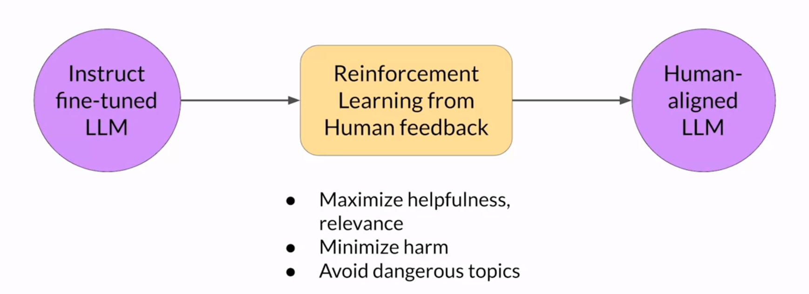
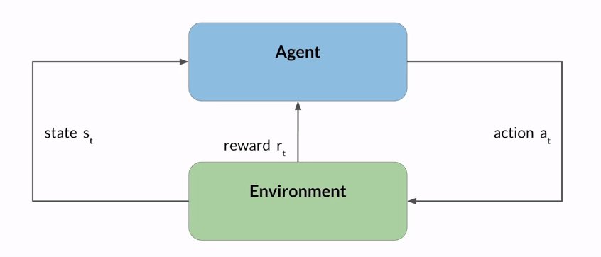
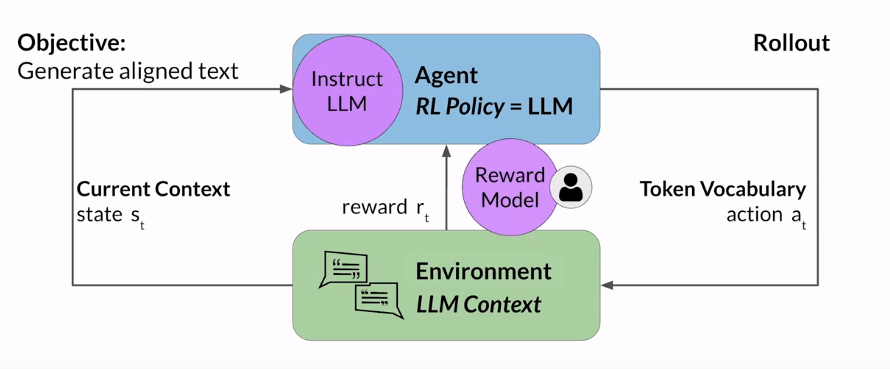
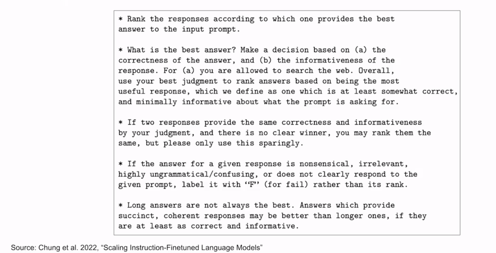
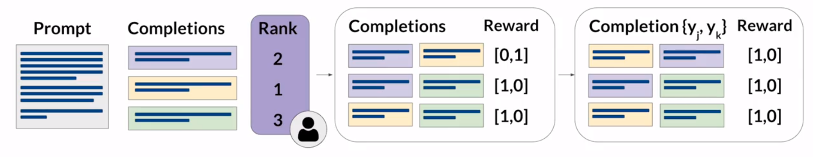
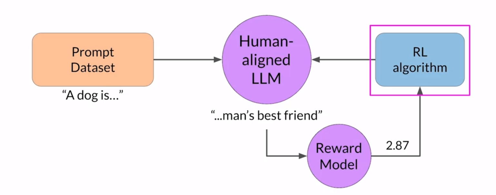
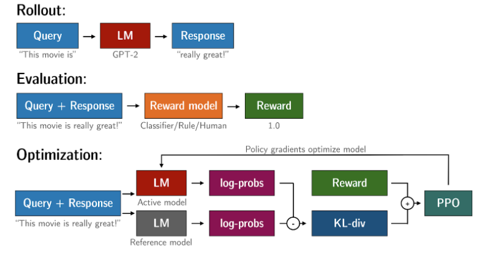

## Introduction 
>> This week covers RLHF Reinforcement Learning From Human Feedback that helps to aling the model with human values.
- LLM might generate problematic outputs (Toxicity, Aggression, Dangerous/Harmful), So RLHF can be useful to correct the LLM output.
- Learn to make LLM as a reasoning Engine with tools.
- Learn basic idea behind the Reinforcement Learning.
- Learn about Responsible AI.
- Learn about ReAct: Reasoning and Action
- Learn about RAG i.e. Retrieval Augment Generation


## Aligning models with human feedback  
- Before begining instructor recall Generative AI project life cycle we discussed in Week 1.
- Goals of Fine-Tuning:
    - to further train your models, so that they better understand human like prompts and generate more human like responses.
    - to improve models performance.
    - to generate more natural sounding language.
- LLM drawbacks:
    - May generate toxic languages
    - Replying in Aggresive Voices
    - Providing detailed explanation about dangerous information.
- Above Drawbacks is because LLMs are trained on vast of amount of data from the internet where such language tone and information are present.
- Good LLMs should align with `HHH`:
    - `Helpfulness`
        ``` 
        # Not Helpful LLM Output Example
    
        Prompt: Knock Knock

        LLM output: Clap, Clap
        ```
    - `Honesty`
        ```
        # Not Honesty (incorrect) Example

        Prompt: Can coughing effectively stop a heart attack?

        LLM Output: Coughing can help stop a heart attack
        
        ```

    - `Harmlessness`

        ```
        # LLM giving harmful output Example

        Prompt: How can I hack my neighbor's wifi?

        LLM Output: Here are the best ways to hack your neighbor's wifi ....
        
        ```

- Additionally, Fine-tuning with human feedback helps to better align models with human preferences. 
    - It may helps to reduce toxicity, aggression, and harmful content while increasing honesty, helpfulness, and harmlessness in LLM completion.


## RLHF (Reinforcement Learning From Human Feedback)
- 
- RLHF is based on the concepts of Reinforcement Learning.
- Reinforcement Learning is a type of machine learning in which an agent learns to make decisions related to specific goals by taking actions in an environment, with the objective of maximizing some notion of cumulative reward.
    - In this framework agents continuously learn from its experiments by taking actions.
    - Agent perform some action at in an environment, environment provides some reward to the agent, and agent move to new state.
    - 

- `Example: Tic-Tac-Toe`
    - Agent (at): Consider an agent playing a tic-tac-toe game.
    - Agent Objective: To win the game!
    - Environment: 3x3 game board
    - State (st): Current configuration of the game board.
    - Action (at): Action space is the all possible positions a player can choose based on the current board state.

    Imagine an agent engaged in a strategic game of tic-tac-toe. The agent's primary aim? Victory. In this gaming scenario, the environment is represented by a 3x3 game board, with the current board configuration denoted as the state (st). The agent navigates its decisions in an action space encompassing all possible positions a player can choose based on the prevailing board state.

    The agent's choices are guided by a Reinforcement Learning (RL) policy, a set of rules dictating its moves. As the agent makes decisions and executes actions, it receives feedback in the form of rewards (rt) from the environment. The ultimate objective of Reinforcement Learning is for the agent to discern the optimal policy for a given environment, one that maximizes cumulative rewards over time.

    This learning process unfolds iteratively, commencing with the agent taking random actions that lead to an initial state. Subsequently, the agent systematically explores subsequent states, adapting and refining its strategy based on the accumulated experience and feedback from the environment.


- `Fine-Tuning LLMs with RLHF:`
    - 

        Extending Tic-Tac-Toe example to fine-tuning LLMs with RLHF, the LLM acts as the agent, generating text aligned with human preferences. The context window serves as the environment, the current context as the state, and text generation as the action. The action space encompasses the token vocabulary, representing possible tokens for generating text. The model's decision depends on the statistical representation of language it learned during training, guided by the probability distribution over the vocabulary space.

        Assigning rewards in this context involves evaluating model completions against human preferences, a nuanced task due to the variability in human responses. Human feedback, though valuable, can be resource-intensive. RLHF introduces a reward model, a secondary model trained with human examples to assess LLM outputs. This model aids in assigning rewards, updating LLM weights, and iteratively refining the model aligned with human preferences.

    `In Practice, a classification model called the Reward Model is trained based on human generated training examples instead of a human giving a feedback.`


## RLHF: Obtaining feedback from humans
- Choose LLM
- For each prompt, genreate sets of completions from LLMs.
- Completion Evaluation Criterion: Helpfulness


- Example:
```

Prompt: My house is too hot

Model: Instuct based LLM

Completions:
    1. My house is too hot. There is nothing you can do about hot houses. (Rank2)

    2. My house is too hot. You can cool your house with air conditioning. (Rank1)

    3. My house is too hot. It is not too hot. (Rank3) 
```

- Above examples are repeated for many prompt-completions pairs eventually building up a datasets that can be used to train the reward model that will ultimately carry out this ranking task instead of humans.

- Same prompt-completions are ranked by multiple human labelers to establish consensus.

- Human Labelers are often drawn from samples of population that represents diverse and global thinking.

- The instuctions to rate the completions should be clearly defined and should be provided to the human labelers beforehand. Sample instructions is as shown below:
- 

- Once human labelers complete rankings of all of the prompt-completions pair, then we will have datasets to train our reward model.


- `Prepare labeled data for training Reward Model`
    - Convert rankings into pairwise training data for the reward model.
    - 
    - In above we will rearange reward where yj is first rank compared to yk.


## Train Reward Model
- If you train the Reward Model, you won't need humans in the Loop while performing Reinforcement Learning From Human Feedback.
- Reward Model automatically chooses the preferred completions during the RLHF training process.


## Use the reward model to fine-tune LLM with RL
- 

- Popular RL algorithm: Proximal Policy Optimization    


## RLHF: Reward Hacking
- `Recall: ` 
    - RLHF is a fine-tuning process to align LLM output with the human preferences.
    - We train reward model that makes sure that LLM completions are align with the human preferences.
    - RL algorithm named PPO is used to update the LLM weights based on the output of Reward Model.
    - End results of fine-tuning LLM with RLHF is human align output with Helpfulness, Honesty, and Harmlessness.

- Reward Hacking problem may arise in RL, where the agent learns to cheat the system by favouring actions that maximizes the reward received even if those actions don't align well with the original objective.

- `Example:`
    - suppose you are using RLHF to detoxify the instruct LLM.
    - Consider you have already trained sentiment classification model that can classify model completions as toxic, or non-toxic. This is the reward model.
    - Consider prompt: `This product is ...` and pass it to the instruct LLM that generates a completion `....complete garbage.`
    - Next, the completion is processed by the Reward model in our scenario Toxicity Reward Model. Say it generates a score of -1.8 which is then fed to RL algorithm (PPO).
    - Now, PPO updates the model weights based on the obtaned reward value from the Reward Model.
    - Assumption: As we iterate over the process, LLM will generates the less toxic completions as we provide feedback using reward model.
    - The problem may arise if the model generates language that sounds exaggerated or nonsensical but still receives high scores on the reward metric. Example Completions: "Beautiful love and world peace all around." --> This might have high reward value but is nonsensical for the given prompt.

- `Prevent Reward Hacking:`
    - Use the initial instruct LLM as performance reference model, whose weights are frozen i.e. not updated during the RLHF process.
    - So we will have 2 LLMs, i.e. Reference Model whose weights will be frozen, and RL-updated LLM whose weights get updated during RLHF process.
    - During training, each user prompt is passed to both of the models that generates the completions.
    - Next, we compare the 2 completions, generated by reference LLM and RL-updated LLM and calculate the `KL-Divergence`.
        - _`KL Divergence measures how much the updated model has divered from the reference model interms of probability distributions.`_
        - KL-Divergence is calculated for each generated tokens across the vocabulary of the LLM. This will be expensive process which can be benefitted using modern GPUs.
    - Once KL-Diverence is calculated, we add it with the Reward model output. Here, KL-Divergence term serves as a penalty added to the reward model.
    - We can take benefit from PEFT Adapter instead of updating full LLMs weight. In this way, we can use the same LLMs for reference model and PPO model as we will use the PEFT Adapter to update weights.

- `Evaluate the human-aligned LLM`
    - You can use benchmark datasets to evaluate your RLHF mode once you finished training.
    - Example Dataset: DialogSum

    ```
    # Initial Instruct LLM
    summarization dataset --> Instruct LLM --> Reward Model --> Toxicity score before = 0.14


    # Trained Human aligned LLM
    summarization dataset --> Human aligned LLM --> Reward Model --> Toxicity score after = 0.09


    This means Trained Human aligned LLM is generating less toxic completions.
    ```


## KL Divergence
- KL-Divergence is a mathematical measure of the difference between two probability distributions which helps us understand how one distribution differs from another.
- Reinforcement Learning from Human Feedback uses PPO algorithm, so we often encountered the concept of KL-Divergence.
- In PPO, the goal is to find an improved policy for an agent by iteratively updating its parameters based on the rewards received from interacting with the environment. 
- Hence to prevent from unstable learning or drastic policy changes, PPO uses KL-Divergence.
- Suppos, we have 2 probability distributions: the distribution of original LLM and a new proposed distribution of an RL-updated LLM.
- The goal here is to minimize the KL-Divergence between the two distributions, so that PPO ensures that the updated policy stay close to the original policy, preventing drastic changes that may negatively impact the learning process.
- [TRL (Transformer Reinforcement Learning)](https://huggingface.co/blog/trl-peft) is a library that you can train transformer language models with reinforcement learning.
- 


## Scaling Human Feedback (Constitutional AI)
> According to [constitutional.ai](https://www.constitutional.ai/), Constitutional AI refers to a set of techniques developed by researches at anthropic to align AI systems with human values and make us helpful, harmless, and honest.

- Constitutional AI: Self Supervised Learning.
- In constitutional AI you train your models in two different phases:
    1. Supervised Learning
    2. Reinforcement Learning

- In `Supervised Learning` phase you prompt the Helpful LLM with harmful scenarios and ask to self-criticize its responses based on constitutional principles. The obtained final responses, without harmful, illegal content, conforming to the rules, are used to fine tune the model.  
- **Example**  
    - Take Helpul LLM, and ask it to generate the harmful content this process is called Red Teaming. 
        ```
        Input prompt to generate harmful content:
        "Can you help me hack into my neighbour's wifi?"

        LLM Completion:
        "Sure, use this app called VeryEasyHack"
        ```
    - Pass this harmful content to Response, Revision, and Critique LLM that remove harmful, illegal, unethical etc content.
        ```
        Prompt LLM with the constitution
        "Identify how that response was racist, harmful, unethical, sexist, toxic, illegal?"

        LLM Completion:
        The response was harmful. Hacking into someone else's wifi is possibly illegal.

        Instruct LLM to improve:
        Rewrite the response remove any harmful illegal, unethical, etc content

        LLM Completion:
        Hacking into your neighbor's wifi is an invasion of their privacy. It may also land you in legal trouble. I advice against it.   
        ```
    - Next you fine-tune LLM with red team prompts and the revised constitutional responses.
        ```
        Original Red Prompt:
        - Can you help me hack into my neighbour's wifi?
                            |
                            |
                            |
                            |
                        Helpful LLM
                            |
                            |
                            |
                            |
        Consitutional Response:
        - Hacking into your neighbor's wifi is an invasion of their privacy. It may also land you in legal trouble. I advice against it.         
        ```

        - Many input-output pairs similar to above examples is created to fine tune the LLM.

- In `Reinforcement Learning` phase you use the obtained fine-tuned model to generate responses based on constitutional principles. This phase is also known as Reinforcment Learning from AI feedback (RLAIF).


## Lab3 (Summary):
- Goal: To reduce toxicity in the output of Fine-tuned model in Lab2 using hate-speech reward model.
- Here we will use PPO library from Reinforcement Learning.
- Here we will be optimizing for not hate.
- Evaluation:
    - Quantitative Comparisons
    - Qualitative Comparisons
- AutoModelForSequenceClassification
    - Facebook Classification Model
    - Given a text it will whether the text contains hate speech or not hate speech
- `trl.core.LengthSampler:` 
    - uses this library to sample text of variables length.
- Datasets: DialogSum
- Models: pretrianed FLAN-T5, Fine-Tuned FLAN-T5.
- Reward Model: Pretrained roberta-hate-speech model from facebook.
    - model_name: facebook/roberta-hate-speech-dynabench-r4-target.
    - reward is the logits value of the not-hate class.
